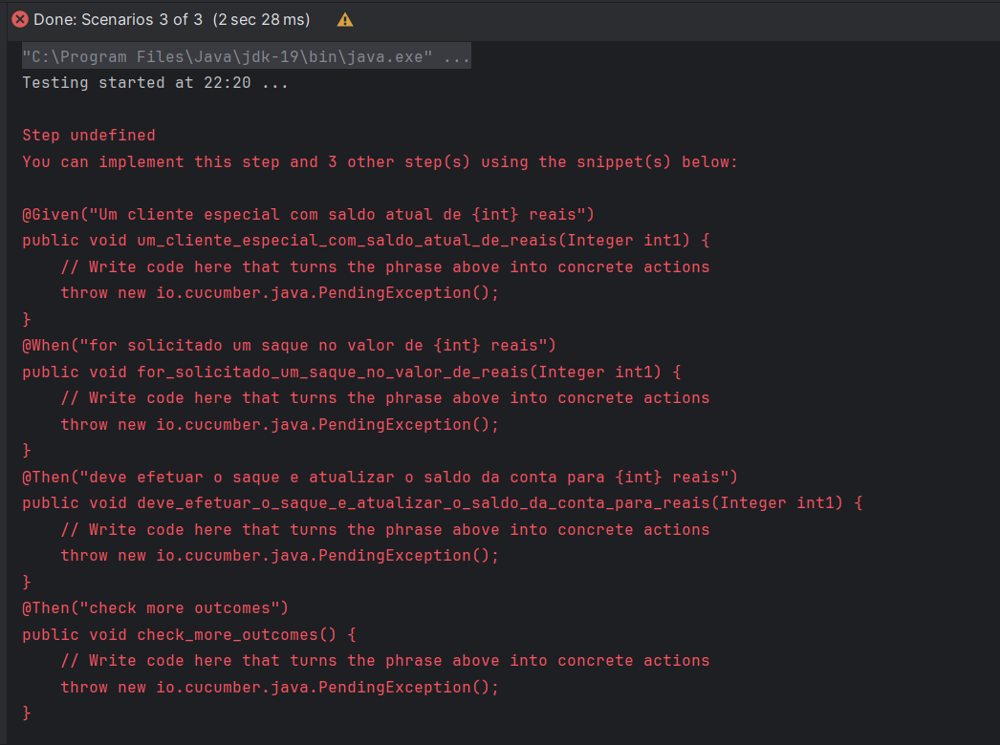

# Testes Conta Bancária
## Testes com Cucumber

Ao executar o código no Cucumber, ele retorna métodos que serão necessários para
  realizar os testes. A seguir, estão descritos os testes da classe teste.feature.

      @tag
      Feature: Cliente faz saque de dinheiro como um cliente,
        eu gostaria de sacar dinheiro em caixa eletrônico,
        para que eu não tenha que esperar em uma fila do banco.
      
      @tag1
      Scenario: Cliente especial faz saque de dinheiro com saldo negativo
        Given Um cliente especial com saldo atual de -200 reais
        When for solicitado um saque no valor de 100 reais
        Then deve efetuar o saque e atualizar o saldo da conta para -300 reais
        Then check more outcomes
    
      @tag2
      Scenario Outline: Cliente comum com saldo negativo
        Given Um cliente comum com saldo atual de -200 reais
        When solicitar um saque de 200 reais
        Then não deve efetuar o saque e deve retornar a mensagem saldo insuficiente
        Examples:
          | Nome   | Valor | Resultado |
          | teste1 | -100  | Aceito    |
          | teste2 | -200  | Negado    |

 ## Criação de Classes

  A seguir, foi realizada a criação das classes conforme os testes do Cucumber
  solicitaram.

         /**
         * Criando classe com ambos tipos de cliente para testar cenários de saque.
         */
        public class Cliente {
            private Integer saldo;
            private boolean especial;
        
            /**
             * @author Eduardo
             * @param int1 esta variável indica o saldo atual da conta.
             */
            @Given("Um cliente especial com saldo atual de {int} reais")
            public void um_cliente_especial_com_saldo_atual_de_reais(Integer int1) {
                // Write code here that turns the phrase above into concrete actions
                saldo = int1;
                especial = true;
            }
        
            /**
             * @author Eduardo
             * @param int1 esta variável indica o valor da tentativa de saque..
             */
            @When("for solicitado um saque no valor de {int} reais")
            public void for_solicitado_um_saque_no_valor_de_reais(Integer int1) {
                // Write code here that turns the phrase above into concrete actions
                System.out.println("Saldo atual: " + saldo);
                System.out.println("Valor de saque solicitado: " + int1);
                saldo -= int1;
            }
        
            /**
             * @author Eduardo
             * @param int1 esta variável indica o saldo final da conta após a operação.
             */
            @Then("deve efetuar o saque e atualizar o saldo da conta para {int} reais")
            public void deve_efetuar_o_saque_e_atualizar_o_saldo_da_conta_para_reais(Integer int1) {
                // Write code here that turns the phrase above into concrete actions
                    System.out.println("Saque efetuado com sucesso. Saldo restante: " + saldo);
            }
        
            /**
             * @author Eduardo
             */
            @Then("check more outcomes")
            public void check_more_outcomes() {
                // Write code here that turns the phrase above into concrete actions
        
            }
        
            /**
             * @author Eduardo
             * @param int1 esta variável indica o saldo atual da conta.
             */
            @Given("Um cliente comum com saldo atual de {int} reais")
            public void um_cliente_comum_com_saldo_atual_de_reais(Integer int1) {
                // Write code here that turns the phrase above into concrete actions
                System.out.println("Saldo atual: " + int1);
                saldo = int1;
                especial = false;
            }
            @When("solicitar um saque de {int} reais")
            public void solicitar_um_saque_de_reais(Integer int1) {
                // Write code here that turns the phrase above into concrete actions
                if (saldo >= int1){
                    saldo -= int1;
                    System.out.println("Saque efetuado com sucesso!");
                }
            }
            @Then("não deve efetuar o saque e deve retornar a mensagem saldo insuficiente")
            public void não_deve_efetuar_o_saque_e_deve_retornar_a_mensagem_saldo_insuficiente() {
                // Write code here that turns the phrase above into concrete actions
                System.out.println("Saldo insuficiente!");
            }
        }
        

  ## Testes finais do projeto utilizando a classe Runner.

